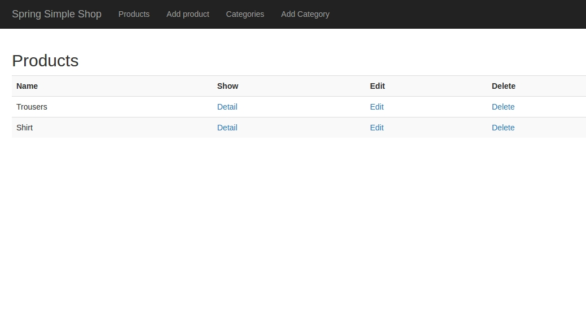
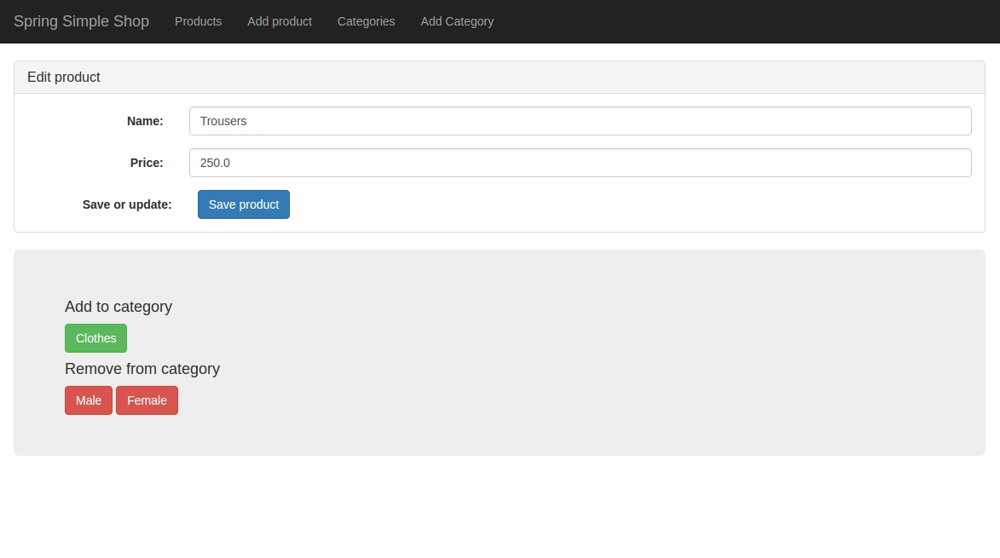

# spring-simple-shop

Run project
-----------------------------

Best way is use Maven. In the root of project run this command.

```
mvn spring-boot:run
```

Now you can see project in your browser.

```
http://localhost:8080/
```



